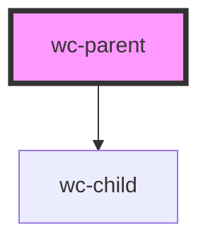

# wc-parent

<!-- Auto Generated Below -->

## Properties

| Property        | Attribute        | Description | Type     | Default     |
| --------------- | ---------------- | ----------- | -------- | ----------- |
| `content`       | `content`        |             | `any`    | `undefined` |
| `contentSrc`    | `content-src`    |             | `string` | `undefined` |
| `contentString` | `content-string` |             | `string` | `undefined` |

## Dependencies

### Depends on

- [wc-child](../wc-child)

### Graph

----------------------------------------------

*Built with [StencilJS](https://stenciljs.com/)*
